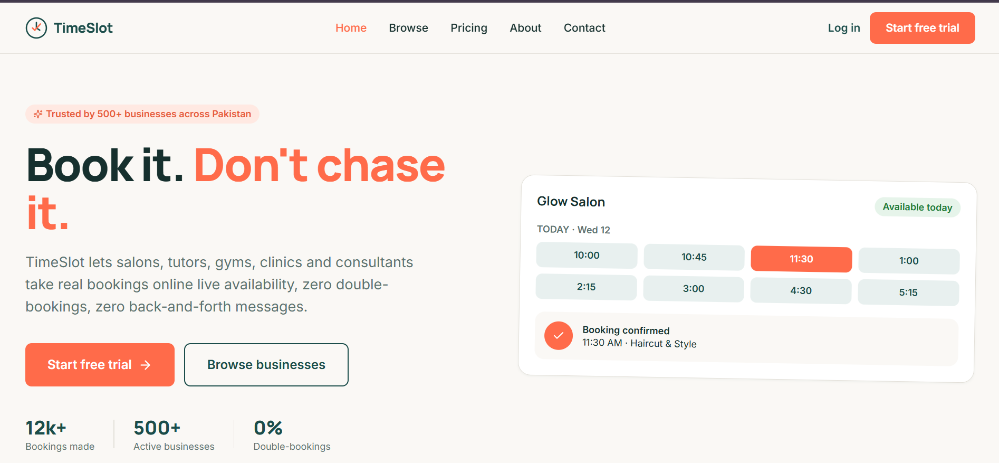
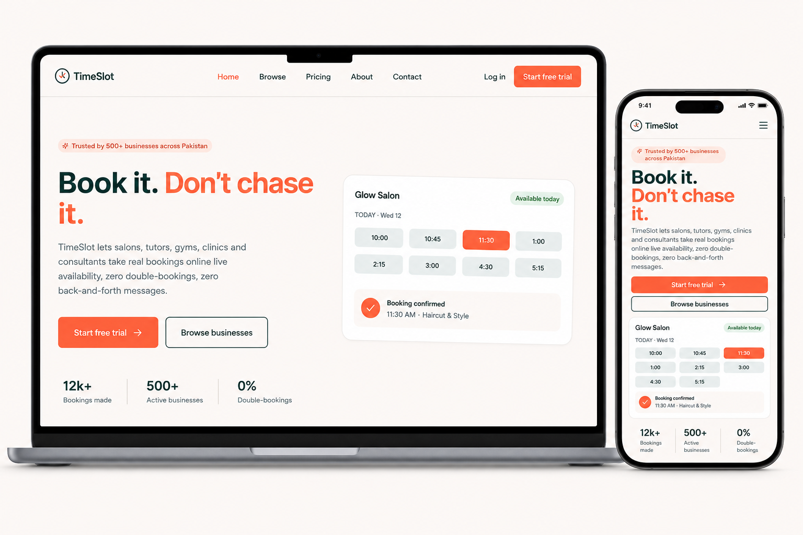
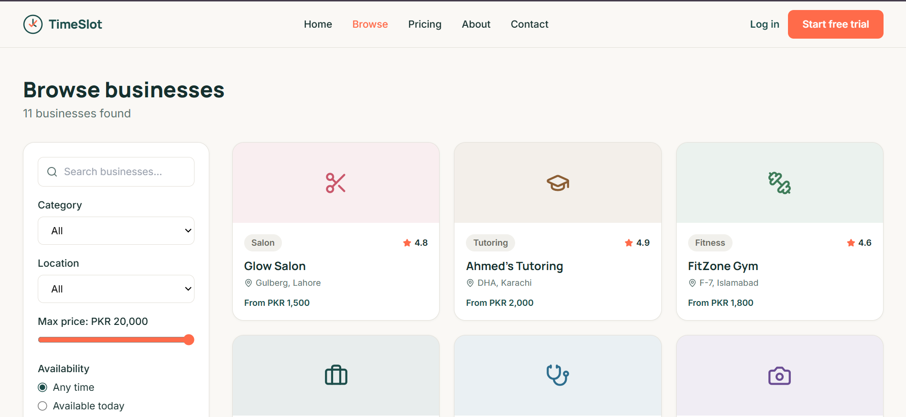
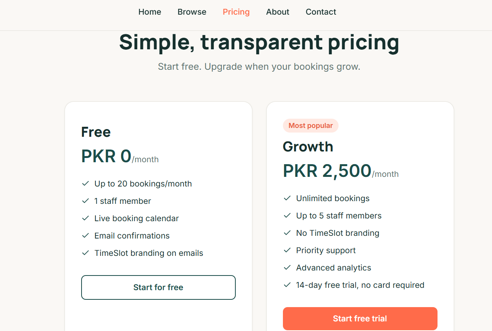
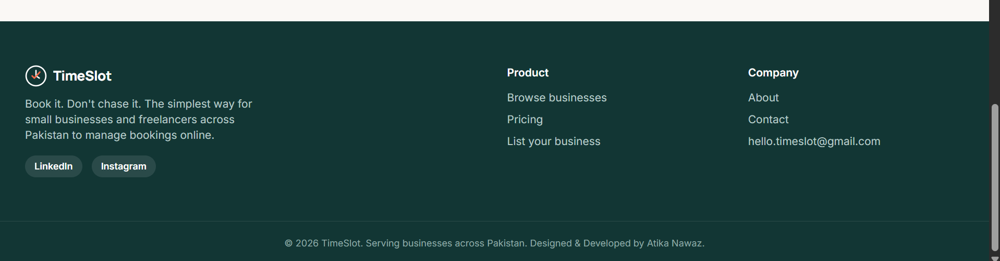

<div align="center">

# ⏱️ TimeSlot

### A Modern Online Booking Platform for Businesses & Customers

Book appointments online with real-time availability — no calls, no back-and-forth, no double-bookings.

<br>

[](https://timeslot-dusky.vercel.app/)
[](https://github.com/AtikaNawaz/TimeSlot)

<br>


</div>

---

# ✨ Overview

**TimeSlot** is a modern online booking platform designed for small businesses and service providers that want to manage appointments without relying on calls, messages, or manual scheduling.

Customers can discover businesses, explore available services, view booking availability, and reserve a suitable time slot.

Businesses can use TimeSlot to present their services, manage booking availability, and provide customers with a simpler booking experience.

> **Book it. Don't chase it.**

---

# 🌐 Live Demo

### 🚀 Try TimeSlot

**Live Website:**  
https://timeslot-dusky.vercel.app/

### 📂 GitHub Repository

**Source Code:**  
https://github.com/AtikaNawaz/TimeSlot

---

# 🎯 The Problem

Traditional appointment booking often involves:

- 📞 Calling businesses to ask about availability
- 💬 Sending messages and waiting for replies
- 🔄 Going back and forth to find a suitable time
- ⚠️ Manually handling schedules
- ❌ Risk of double-bookings

TimeSlot is designed around a simpler idea:

### **See the availability. Pick a slot. Book it.**

---

# 💡 What TimeSlot Provides

TimeSlot brings the booking experience into one simple platform.

### 👤 For Customers

- 🔎 Discover businesses
- 🏷️ Browse by category
- 📍 Explore businesses by location
- 💰 View starting prices
- ⭐ Compare ratings
- 🕐 Check available time slots
- 📅 Book appointments online
- 📱 Use the platform across desktop and mobile

### 🏢 For Businesses

- 📋 Present services in one place
- 🗓️ Provide live booking availability
- 👥 Manage customer bookings
- 🚫 Reduce scheduling conflicts
- 📈 Support business growth with a structured booking experience
- 🎨 Maintain a professional online presence

---

# ✨ Key Features

## 🏠 Modern Landing Page

A clean SaaS-style homepage communicates the core value of TimeSlot immediately.

- Clear value proposition
- Primary and secondary CTAs
- Booking availability preview
- Business statistics
- Responsive layout
- Modern visual hierarchy

---

## 🔎 Business Discovery

Customers can browse businesses through an organized discovery experience.

- Business search
- Category filtering
- Location filtering
- Maximum price filtering
- Availability filtering
- Business cards
- Ratings and starting prices

---

## 📅 Booking Experience

The platform focuses on making appointment scheduling straightforward.

- Available time-slot display
- Visual booking states
- Service information
- Booking confirmation flow
- Reduced back-and-forth communication

---

## 💰 Transparent Pricing

TimeSlot includes a simple pricing experience with:

### Free

- Up to 20 bookings/month
- 1 staff member
- Live booking calendar
- Email confirmations
- TimeSlot branding on emails

### Growth — PKR 2,500/month

- Unlimited bookings
- Up to 5 staff members
- No TimeSlot branding
- Priority support
- Advanced analytics
- 14-day free trial
- No card required

---

# 📸 Screenshots

## 🏠 Homepage

The TimeSlot homepage introduces the platform with a clear booking-focused experience.

<p align="center">
  
</p>

---

## 📱 Responsive Experience

TimeSlot is designed to provide a consistent experience across desktop and mobile screens.

<p align="center">
  
</p>

---

## 🔎 Browse Businesses

Customers can search and filter businesses based on their preferences.

<p align="center">
  
</p>

---

## 💰 Pricing

A simple pricing structure makes it easy for businesses to understand the available plans.

<p align="center">
  
</p>

---

## 🌊 Footer & Brand Experience

The platform maintains a consistent visual identity throughout the experience.

<p align="center">
  
</p>

---

# 🎨 Design System

TimeSlot uses a clean, modern SaaS visual language focused on clarity and usability.

### Visual Direction

- Minimal interface
- Generous whitespace
- Rounded cards and controls
- Strong typography
- Clear call-to-action buttons
- Soft neutral backgrounds
- Coral accent color
- Deep teal primary color
- Responsive layouts

### Brand Colors

| Color | Usage |
|-------|-------|
| Deep Teal | Primary text, navigation, branding |
| Coral | CTAs, highlights, active states |
| Warm Off-White | Main background |
| Soft Pastels | Category and business-card sections |

---

# 🛠️ Tech Stack

| Technology | Purpose |
|------------|---------|
| React | Frontend UI development |
| Vite | Development server & build tooling |
| JavaScript | Application logic & interactions |
| CSS3 | Responsive styling & visual design |
| Git | Version control |
| GitHub | Source code hosting |
| Vercel | Production deployment |

---

# 📁 Project Structure

```text
TimeSlot/
│
├── public/
│   └── favicon.ico
│
├── src/
│   ├── TimeSlot.jsx
│   └── main.jsx
│
├── .gitignore
├── index.html
├── package.json
├── package-lock.json
├── vite.config.js
└── README.md
```

---

# ⚙️ Local Installation

## 1. Clone the Repository

```bash
git clone https://github.com/AtikaNawaz/TimeSlot.git
```

---

## 2. Open the Project

```bash
cd TimeSlot
```

---

## 3. Install Dependencies

```bash
npm install
```

---

## 4. Start the Development Server

```bash
npm run dev
```

---

## 5. Open in Browser

Vite will provide a local development URL, typically:

```text
http://localhost:5173/
```

---

# 🚀 Production Build

To create a production-ready build:

```bash
npm run build
```

To preview the production build locally:

```bash
npm run preview
```

---

# ☁️ Deployment

TimeSlot is deployed using **Vercel**.

The production deployment is connected to the project's GitHub repository, allowing updates to be deployed from the `main` branch.

### Live Deployment

https://timeslot-dusky.vercel.app/

---

# 🔄 Development Workflow

The project follows a simple Git-based workflow:

```text
Make changes
     ↓
Test locally
     ↓
git add .
     ↓
git commit
     ↓
git push
     ↓
GitHub
     ↓
Vercel Deployment
```

---

# 🎯 Learning Outcomes

Building TimeSlot strengthened practical experience in:

- React component development
- Modern frontend architecture
- Responsive web design
- UI/UX implementation
- State and interaction handling
- Search and filtering interfaces
- Booking-flow design
- SaaS product presentation
- Git & GitHub workflow
- Vercel deployment
- Building a product from concept to deployment

---

# 🔮 Future Enhancements

Potential future improvements include:

- 🔐 Full authentication system
- 🏢 Dedicated business dashboards
- 📅 Advanced calendar management
- 👥 Multi-staff scheduling
- 🔔 Automated booking notifications
- 📧 Email confirmation system
- 💳 Online payment integration
- 📊 Business analytics dashboard
- ⭐ Customer reviews
- 📱 Progressive Web App support
- 🔗 Custom booking links for businesses

---

# 🧠 Product Vision

TimeSlot is built around a simple principle:

> **Booking should be a moment, not a conversation.**

Instead of asking customers to call, message, wait, and confirm, the goal is to give them a clear path from **discovering a business → checking availability → selecting a service → booking a time**.

---

# 👩‍💻 Developer

## Atika Nawaz

**Frontend Developer • MERN Stack Learner • Canva Designer**

TimeSlot was designed and developed as a practical product-focused web project, combining frontend development with UI/UX and product thinking.

### GitHub

https://github.com/AtikaNawaz

### LinkedIn

https://www.linkedin.com/in/atika-nawaz-368695334/

---

# ⭐ Support

If you found TimeSlot interesting or useful, consider giving the repository a **⭐ Star** on GitHub.

It helps support the project and motivates me to keep building and sharing more.

---

<div align="center">

### ⏱️ TimeSlot

**Book it. Don't chase it.**

Built with ❤️ by **Atika Nawaz**

</div>
